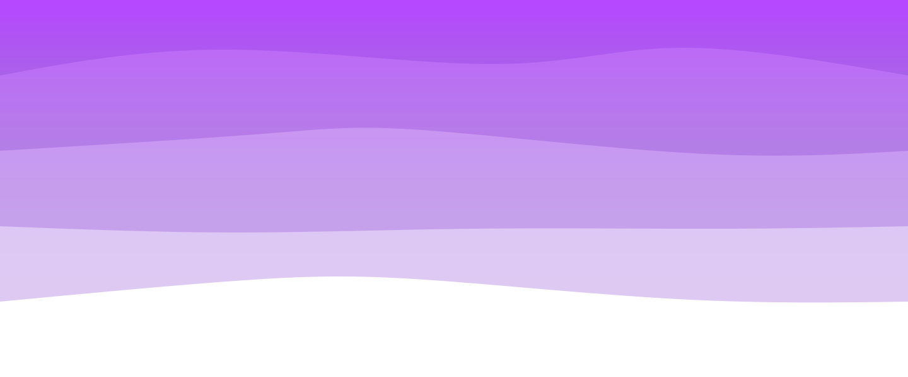
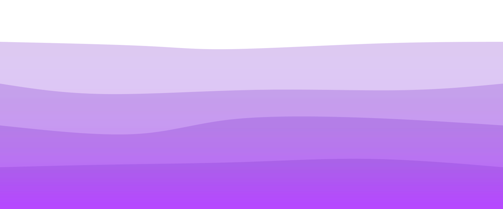

    <header>
        
    </header>

<table align="right">
    <tr><td><a href="https://github.com/alvalenda/alvalenda/blob/main/README-en.md"> :us: EN </a></td></tr>
    <tr><td><a href="https://github.com/alvalenda/alvalenda/blob/main/README.md"> :brazil: PT </a></td></tr>
</table>

## 🤝🏻 Olá!

 
 
    

 

<h2> 🧔🏻 Sobre Mim </h2> 
    

- 🔭 Estudando Desenvolvimento Full Stack
- 🌱 Atualmente Estudando: React, Typescript 
- 📫 Contate-me no e-mail: flavio.alva@outlook.com
- 😄 Pronouns: ele/dele
- 📕 Portfolio: em breve

 

<h2>🕵🏻‍♀️ Contato</h2>
    
    
    
    
    

 
 

<h2>:bulb: Linguagens & Frameworks</h2>

  <code></code>
  <code></code>
  <code></code>
  <code></code>
  <code></code>
  <code></code>
  <code></code>
  <code></code>
  
 

<h2>:hammer_and_wrench: Ferramentas </h2>
    

    <code> </code>
    <code> </code>
    <code></code>
    <code></code>
    <code> </code>
    <code></code> 
    <code></code>
    <code></code>
    <code></code>
    <code></code>
  
 
 

  <!--  -->

 

<h2> 📊 Estatísticas do Github</h2>
 
    

        

##

  

  
##
<footer>
    
    
</footer>

